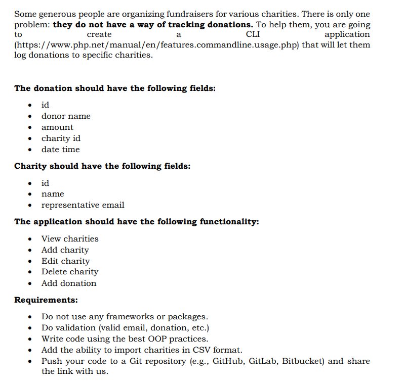

1. Clone to htdocs folder: git clone https://github.com/kasparasd/php-fundraiser-cli.git
2. To create database and tables run in terminal: php index.php db
3. By default created database name will be: fundraiser. If you wish to have different name please edit .env file.

To see all available commands run: php index.php help

There's one csv file in csv folder, you can add these charities with command: php index.php csv charities.csv

If you want to add your own csv file, please put it in csv folder. And run command: php index.php csv yourFileName.csv

Task:

;
